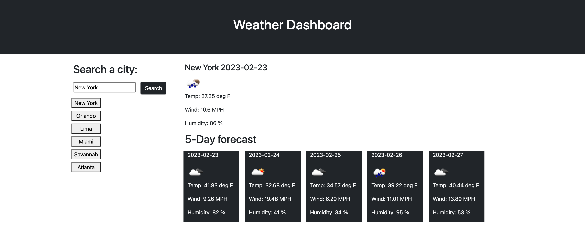

# Weather-API

## Description
This webpage was created to provide real-time weather data and forecasts. Jst type in a city name and the current weather will display, as well as a 5 day forecast. Previous cities will be stored when you type in a new one. Clicking on the previous city names and the webpage will update and give you the the current weather and 5 day forecast. 

## Links

- [Live](https://cailenh.github.io/My-Weather-API/)

## Screenshots

## Available Commands

N/A

## Built With

- HTML
- CSS
- JavaScript

## Future Updates

- N/A

## Author

**Cailen Hamm**

- [Email](mailto:cailenhamm@gmail.com?subject=Hi "Hi!")

## 🤝 Support

Contributions, issues, and feature requests are welcome!

Give a ⭐️ if you like this project!